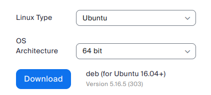
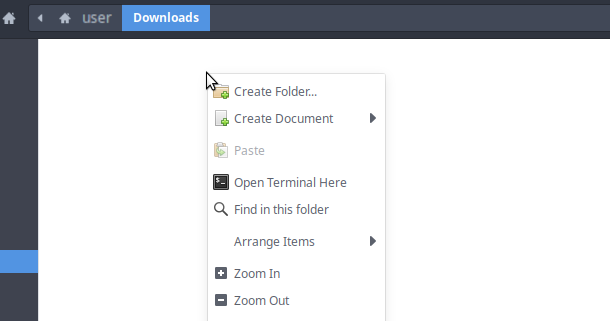
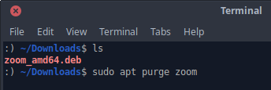

# Install Zoom Client

Two ways to do this:
1. You could use the web client that you can start from inside your web browser.
2. you could download and install the linux version on your pc.

### Install and Download on you PC:
Go to https://zoom.us/download and download the version for your Linux System.  
  

Go to your Download Folder and open your Terminal via `right-click` on some white space in your file explorer  


If there is `~/Downloads` at the beginning of a line, just like in this picture here..  


..then your Terminal is waiting in the correct directory.  
You can type `ls` to list all the files that are in the current directory.  
If you are satisfied, then you can go on with the installation.  

First it is recommended to delete any old Versions of the program that you are going to install, as they might be the reason that you had any problems.
```bash
sudo apt purge zoom
```

(Optionally) If you also downloaded and imported the Public Key, you can verify the downloaded package before installing it:
```bash
gpg --verify zoom_amd64.deb
```

Then install the debian installation package (.deb) with the command:
```bash
sudo apt-get install ./zoom_amd64.deb
# or with the command
sudo dpkg -i zoom_amd64.deb
```

If there are any messages about missing packages or dependencies or what have you, just try the command:
```bash
sudo apt install --fix-broken
```
This command will try to find any missing packages that didn't install automaticly.

Now you should be done and you can restart your PC.
After restart, Zoom should be able to start without a problem.

---

Terminal-only version:
```bash
wget -L https://zoom.us/client/latest/zoom_amd64.deb -P $HOME/Downloads/
cd $HOME/Downloads/
gpg --verify zoom_amd64.deb
sudo apt-get install ./zoom_amd64.deb -y
reboot
```

.